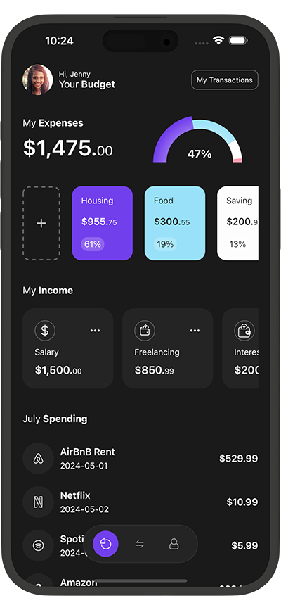

# Finance App in React Native with Expo Router 

This is an [Expo](https://expo.dev) project created with [`create-expo-app`](https://www.npmjs.com/package/create-expo-app) to create a Finance App UI in React Native. Along with App UI, here I've implemented custom bottom tabbar navigator with expo router v3 and pie chart with [react native gifted charts](https://github.com/Abhinandan-Kushwaha/react-native-gifted-charts) package.

Libraries used in this project

- [Expo](https://expo.dev)
- [React Native Gifted Charts](https://github.com/Abhinandan-Kushwaha/react-native-gifted-charts)
- [React Native SVG Tansformer](https://github.com/kristerkari/react-native-svg-transformer)


## Get started

1. Install dependencies

   ```bash
   npm install
   ```

2. Start the app

   ```bash
    npx expo start
   ```

## App Screenshot


## Watch it on YouTube

This repository is part of a tutorial on my [YouTube channel](https://www.youtube.com/@itzpradip). Check out the complete tutorial on YouTube by clicking below. 👇

[](https://youtu.be/MLVxvof54KA)

